# Домашнее задание к занятию «Вычислительные мощности. Балансировщики нагрузки»  

### Подготовка к выполнению задания

1. Домашнее задание состоит из обязательной части, которую нужно выполнить на провайдере Yandex Cloud, и дополнительной части в AWS (выполняется по желанию). 
2. Все домашние задания в блоке 15 связаны друг с другом и в конце представляют пример законченной инфраструктуры.  
3. Все задания нужно выполнить с помощью Terraform. Результатом выполненного домашнего задания будет код в репозитории. 
4. Перед началом работы настройте доступ к облачным ресурсам из Terraform, используя материалы прошлых лекций и домашних заданий.

---
## Задание 1. Yandex Cloud 

**Что нужно сделать**

1. Создать бакет Object Storage и разместить в нём файл с картинкой:

 - Создать бакет в Object Storage с произвольным именем (например, _имя_студента_дата_).
 - Положить в бакет файл с картинкой.
 - Сделать файл доступным из интернета.
 
2. Создать группу ВМ в public подсети фиксированного размера с шаблоном LAMP и веб-страницей, содержащей ссылку на картинку из бакета:

 - Создать Instance Group с тремя ВМ и шаблоном LAMP. Для LAMP рекомендуется использовать `image_id = fd827b91d99psvq5fjit`.
 - Для создания стартовой веб-страницы рекомендуется использовать раздел `user_data` в [meta_data](https://cloud.yandex.ru/docs/compute/concepts/vm-metadata).
 - Разместить в стартовой веб-странице шаблонной ВМ ссылку на картинку из бакета.
 - Настроить проверку состояния ВМ.
 
3. Подключить группу к сетевому балансировщику:

 - Создать сетевой балансировщик.
 - Проверить работоспособность, удалив одну или несколько ВМ.
4. (дополнительно)* Создать Application Load Balancer с использованием Instance group и проверкой состояния.

Полезные документы:

- [Compute instance group](https://registry.terraform.io/providers/yandex-cloud/yandex/latest/docs/resources/compute_instance_group).
- [Network Load Balancer](https://registry.terraform.io/providers/yandex-cloud/yandex/latest/docs/resources/lb_network_load_balancer).
- [Группа ВМ с сетевым балансировщиком](https://cloud.yandex.ru/docs/compute/operations/instance-groups/create-with-balancer).

---
## Решение.

**1.** Создаём бакет `Object Storage` и размещаем в нём файл с картинкой - `picture.jpg`  

[**bucket.tf**](https://github.com/SLOV1977/clopro-homeworks-15.2/tree/main/bucket.tf)  

```
# Создание бакета Object Storage
resource "yandex_storage_bucket" "bucket" {
  bucket        = var.bucket_name
  folder_id     = var.folder_id
}

# Загрузка картинки в бакет
resource "yandex_storage_object" "picture" {
  bucket     = var.bucket_name
  key        = "picture.jpg"
  source     = var.image_path
  acl        = "public-read"
  depends_on = [yandex_storage_bucket.bucket]
}
```


**2.** Создаём группу ВМ в public подсети фиксированного размера с шаблоном LAMP и веб-страницей, содержащей ссылку на картинку из бакета.  

[**instance_group.tf**](https://github.com/SLOV1977/clopro-homeworks-15.2/tree/main/instance_group.tf)

```
resource "yandex_compute_instance_group" "lamp_group" {
  name               = var.lamp_group_name
  folder_id          = var.folder_id
  service_account_id = var.sa_id
  allocation_policy {
    zones = [var.default_zone]
  }

  deploy_policy {
    max_creating     = 1
    max_deleting     = 1
    max_expansion    = 1
    max_unavailable  = 1
    startup_duration = 5
  }

  instance_template {
    platform_id = "standard-v3"

    resources {
      cores  = 4
      memory = 4
    }

    boot_disk {
      initialize_params {
        image_id = var.lamp_image_id
        size     = 20
        type     = "network-hdd"
      }
      mode = "READ_WRITE"
    }

    network_interface {
      subnet_ids = [yandex_vpc_subnet.public.id]
      ipv4       = true
      nat        = true
    }

    metadata = {
      ssh-keys = "ubuntu:${file("~/.ssh/id_ed25519.pub")}"
      "user-data" = <<-EOT
        #!/bin/bash
        apt update -y
        apt install apache2 -y
        systemctl enable apache2
        systemctl start apache2
        echo '<html><body><h1>Greetings from SLOV from LAMP VM</h1></body></html>' > /var/www/html/index.html
      EOT
    }
  }

  scale_policy {
    fixed_scale {
      size = 3
    }
  }

  load_balancer {
    target_group_name        = "lamp-target-group"
    target_group_description = "LAMP target group"
  }
}
```

**3.** Создаём сетевой балансировщик и подключить к нему ранее созданную группу ВМ.  

[**network_lb.tf**](https://github.com/SLOV1977/clopro-homeworks-15.2/tree/main/network_lb.tf)

```
resource "yandex_lb_network_load_balancer" "network_lb" {
  name      = var.network_nlb
  folder_id = var.folder_id
  type      = "external"

  listener {
    name        = "lamp-listener"
    port        = 80
    protocol    = "tcp"
    target_port = 80

    external_address_spec {
      ip_version = "ipv4"
    }
  }

  attached_target_group {
    target_group_id = yandex_compute_instance_group.lamp_group.load_balancer[0].target_group_id

    healthcheck {
      name = "http"

      http_options {
        port = 80
        path = "/"
      }
    }
  }
}
```

**4.** Применяем созданную конфигурацию.  

```
terraform init
terraform plan
terraform apply
```


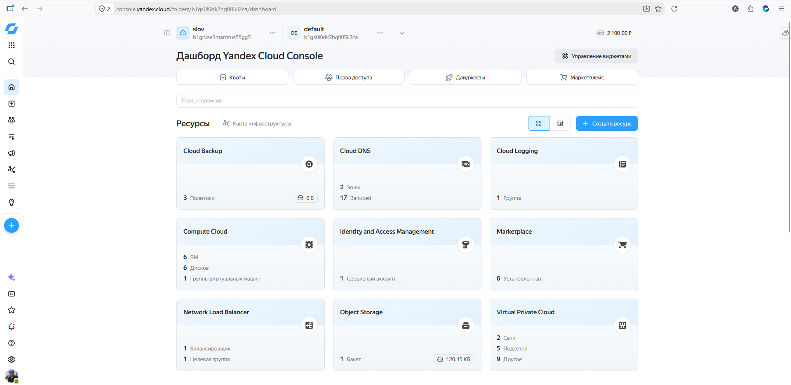


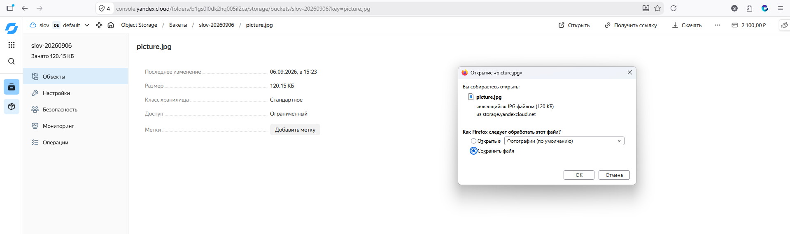


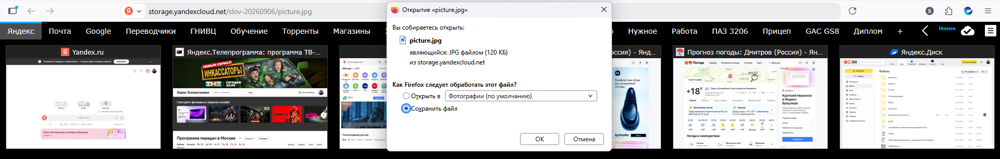


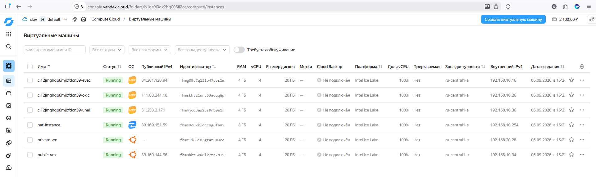


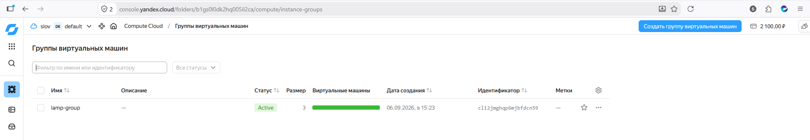


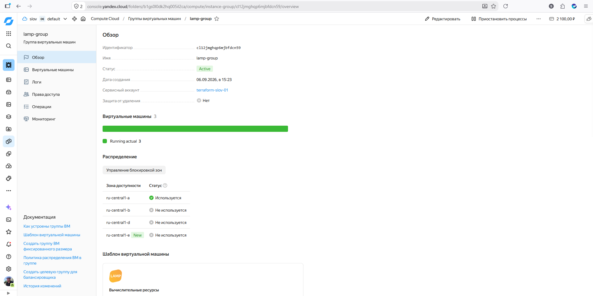


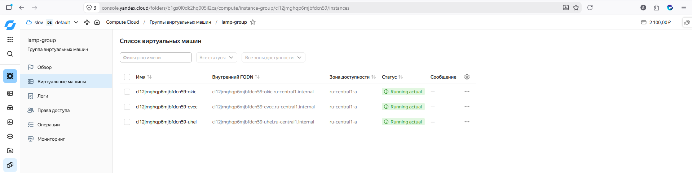


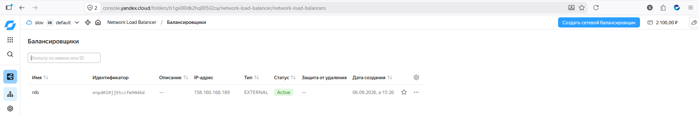


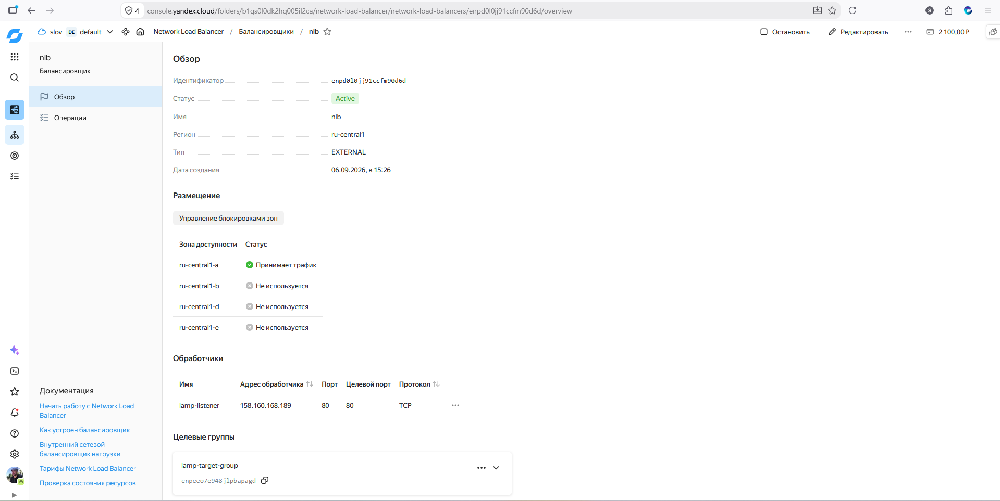


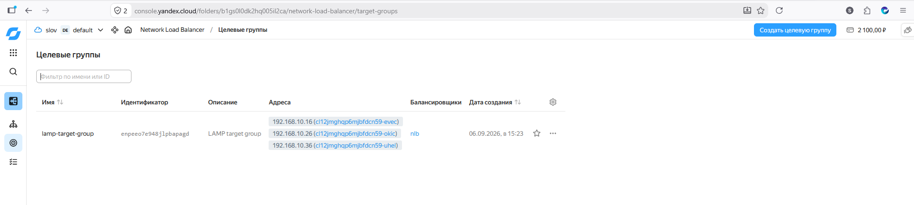


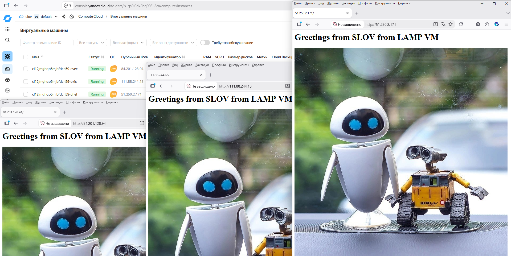


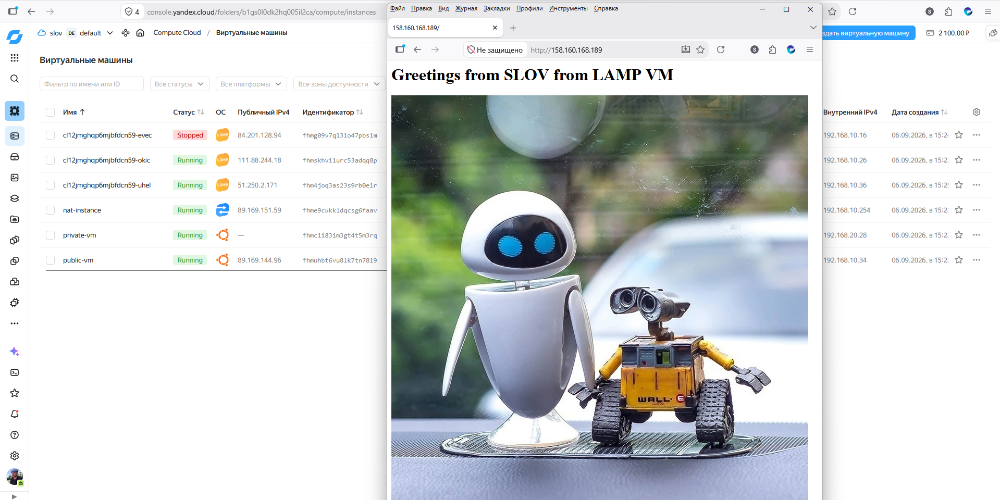


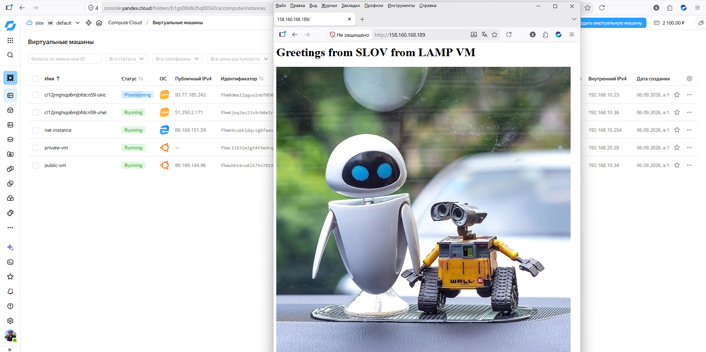

---
## Задание 2*. AWS (задание со звёздочкой)

Это необязательное задание. Его выполнение не влияет на получение зачёта по домашней работе.

**Что нужно сделать**

Используя конфигурации, выполненные в домашнем задании из предыдущего занятия, добавить к Production like сети Autoscaling group из трёх EC2-инстансов с  автоматической установкой веб-сервера в private домен.

1. Создать бакет S3 и разместить в нём файл с картинкой:

 - Создать бакет в S3 с произвольным именем (например, _имя_студента_дата_).
 - Положить в бакет файл с картинкой.
 - Сделать доступным из интернета.
2. Сделать Launch configurations с использованием bootstrap-скрипта с созданием веб-страницы, на которой будет ссылка на картинку в S3. 
3. Загрузить три ЕС2-инстанса и настроить LB с помощью Autoscaling Group.

Resource Terraform:

- [S3 bucket](https://registry.terraform.io/providers/hashicorp/aws/latest/docs/resources/s3_bucket)
- [Launch Template](https://registry.terraform.io/providers/hashicorp/aws/latest/docs/resources/launch_template).
- [Autoscaling group](https://registry.terraform.io/providers/hashicorp/aws/latest/docs/resources/autoscaling_group).
- [Launch configuration](https://registry.terraform.io/providers/hashicorp/aws/latest/docs/resources/launch_configuration).

Пример bootstrap-скрипта:

```
#!/bin/bash
yum install httpd -y
service httpd start
chkconfig httpd on
cd /var/www/html
echo "<html><h1>My cool web-server</h1></html>" > index.html
```
### Правила приёма работы

Домашняя работа оформляется в своём Git репозитории в файле README.md. Выполненное домашнее задание пришлите ссылкой на .md-файл в вашем репозитории.
Файл README.md должен содержать скриншоты вывода необходимых команд, а также скриншоты результатов.
Репозиторий должен содержать тексты манифестов или ссылки на них в файле README.md.
